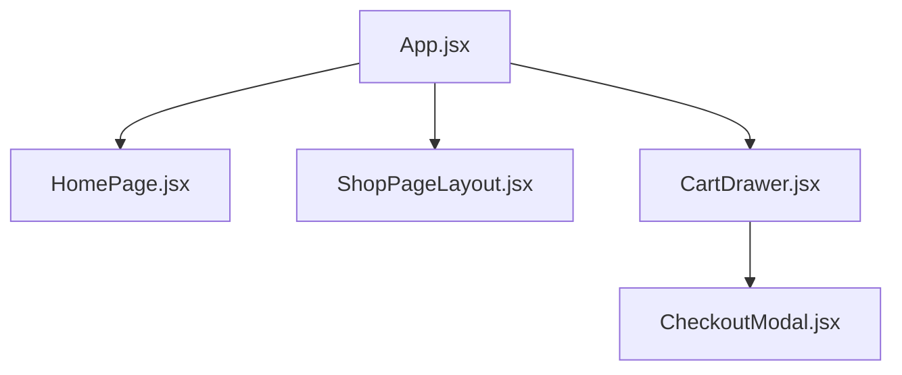
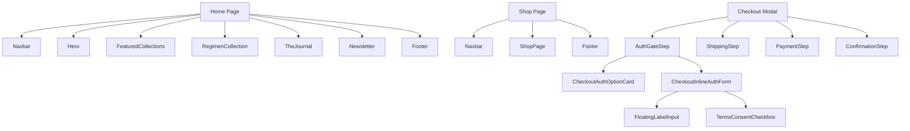

# Front-End Component Visual Map

This map answers a simple question:

- `Can I actually see this component on the screen?`
- `If yes, where does it appear?`
- `If no, what does it support?`

## Legend

- `Visible UI`: rendered in the browser.
- `Structural UI`: assembles visible sections but is not a distinct block by itself.
- `Logic Helper`: affects behavior only and does not render visible UI.

## App-Level Map



## Page And Modal Visual Map



## New Files: Can You See Them?

| File | Type | Visible? | Where You See It | Affects |
|---|---|---:|---|---|
| `src/Components/Shared/AppLink.jsx` | Logic Helper | No | Not directly visible | Used by `Footer`, `App`, and `TermsConsentCheckbox` so internal links use React Router |
| `src/Components/Shared/FloatingLabelInput.jsx` | Visible UI | Yes | Checkout auth form | Makes auth inputs look and behave consistently |
| `src/Components/Shared/Seo.jsx` | Logic Helper | No | Not directly visible | Used by `HomePage` and `ShopPageLayout` to inject meta tags |
| `src/Components/Shared/TermsConsentCheckbox.jsx` | Visible UI | Yes | Register form in checkout auth | Standardizes the consent checkbox and links |
| `src/hooks/usePrefersReducedMotion.js` | Logic Helper | No | Not directly visible | Used by `Footer` to reduce animation for users who prefer less motion |
| `src/Components/Auth/AuthGateStep.jsx` | Visible UI | Yes | First auth step inside checkout modal | Chooses between sign in, create account, or guest checkout |
| `src/Components/Auth/CheckoutAuthOptionCard.jsx` | Visible UI | Yes | First step of checkout modal | Renders the sign-in, create-account, and guest option cards |
| `src/Components/Auth/CheckoutInlineAuthForm.jsx` | Visible UI | Yes | Checkout modal after choosing sign in or register | Handles inline auth during checkout |
| `src/context/auth-context.js` | Logic Helper | No | Not directly visible | Stores the raw React auth context object |
| `src/hooks/useAuth.js` | Logic Helper | No | Not directly visible | Lets visible components consume auth state safely |

## Where These Files Plug In

### 1. Checkout Auth Step

```text
Auth/AuthGateStep.jsx
|- CheckoutAuthOptionCard.jsx
|- CheckoutInlineAuthForm.jsx
   |- FloatingLabelInput.jsx
   |- TermsConsentCheckbox.jsx
      |- AppLink.jsx
```

What you see:

- `CheckoutAuthOptionCard` is the option list you choose from first.
- `CheckoutInlineAuthForm` appears after choosing sign in or create account.
- `FloatingLabelInput` and `TermsConsentCheckbox` are reused shared UI pieces.

### 2. Footer And Navigation Helpers

```text
Footer.jsx
|- AppLink.jsx
|- usePrefersReducedMotion.js
```

What you see:

- You see `Footer`.
- You do not see `AppLink` or `usePrefersReducedMotion`.

What they change:

- `AppLink` keeps internal links inside the SPA.
- `usePrefersReducedMotion` disables motion-heavy behavior for users who prefer less animation.

### 3. Page SEO

`HomePage.jsx -> Seo.jsx`

`ShopPageLayout.jsx -> Seo.jsx`

What you see:

- You do not see `Seo.jsx`.

What it changes:

- browser tab title
- canonical URL
- social sharing metadata
- structured data for search engines

## Components You Probably Will Not Find Visually

- `AppLink.jsx`
- `Seo.jsx`
- `usePrefersReducedMotion.js`
- `auth-context.js`
- `useAuth.js`

## Components You Can Find Right Away

- `FloatingLabelInput.jsx`
- `TermsConsentCheckbox.jsx`
- `AuthGateStep.jsx`
- `CheckoutAuthOptionCard.jsx`
- `CheckoutInlineAuthForm.jsx`

## Quick Visual Search Guide

- Open the cart drawer and click `Proceed to checkout`.
- The first auth screen is `AuthGateStep`.
- The three choices are rendered by `CheckoutAuthOptionCard`.
- Choosing `Sign In` or `Create Account` reveals `CheckoutInlineAuthForm`.
- Open Home or Shop and `Seo.jsx` is active but invisible.
- Open the footer and `AppLink` plus `usePrefersReducedMotion` are supporting it behind the scenes.

## Current Auth Rule

The only auth UI in the project should be the checkout auth flow inside `CheckoutModal`:

- `AuthGateStep.jsx`
- `CheckoutAuthOptionCard.jsx`
- `CheckoutInlineAuthForm.jsx`

The older standalone auth modal has been removed from the app.
