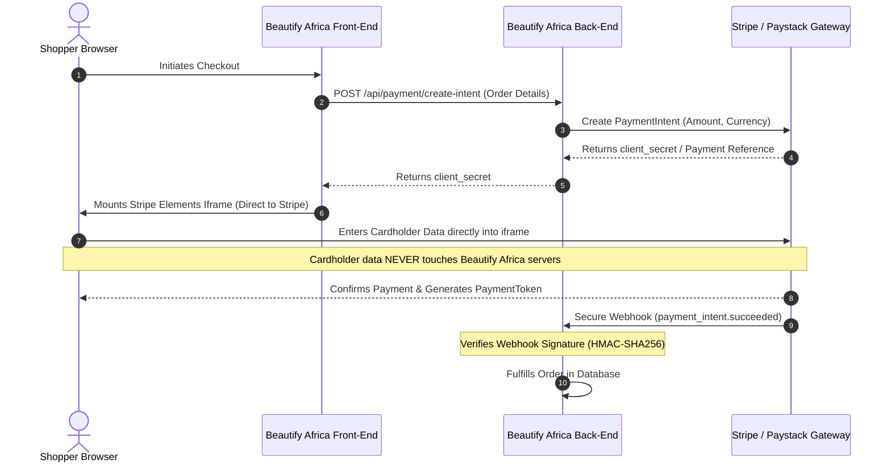

# PCI-DSS SAQ-A Compliance & Payment Boundary Demarcation

## 1. Executive Summary & Scope

Beautify Africa processes electronic commercial payments via third-party tier-1 Level 1 PCI-DSS certified payment service providers:

- **Stripe** (PCI Level 1 Service Provider)
- **Paystack** (PCI-DSS Level 1 Certified)
- **Safaricom M-Pesa** (Encrypted Daraja API)

Under the **Payment Card Industry Data Security Standard (PCI-DSS v4.0)**, Beautify Africa operates strictly under **Self-Assessment Questionnaire A (SAQ-A)**.

### SAQ-A Eligibility Criteria

1. All cardholder data (CHD) processing is completely outsourced to PCI-DSS validated third-party payment service providers.
2. The merchant website does not directly store, process, or transmit any primary account numbers (PAN), cardholder names, expiration dates, or sensitive authentication data (CAV2/CVC2/CVV2/CID).
3. All payment entry points are rendered via secure client-side iframes / popups (Stripe Elements iframe / Paystack SDK) hosted directly on the provider's PCI-compliant infrastructure.
4. Each payment element originates from a secured origin enforced by strict Content Security Policy (`frame-src` and `connect-src`).

---

## 2. Architectural Boundaries & Data Flow

---

## 3. Strict Prohibitions & Enforcement

1. **Zero Primary Account Number (PAN) Retention**:
   - Primary account numbers must **never** be logged, cached, persisted, or forwarded through any application loggers (`pino`, `morgan`, or console).
   - All server log streams enforce PII / Financial Redaction rules on `cardNumber`, `cvv`, `pan`, `pin`, `clientSecret`.

2. **Client-Side Iframe Isolation**:
   - The React frontend mounts Stripe Elements within sandboxed iframes.
   - Keystroke events, DOM elements, and form inputs for card credentials remain completely inaccessible to application scripts, preventing XSS-based scraping or card skimmers.

3. **Content Security Policy (CSP) Restrictions**:
   - Directives:
     - `frame-src 'self' https://js.stripe.com https://checkout.paystack.com`
     - `script-src 'self' https://js.stripe.com https://inline.paystack.co`
     - `connect-src 'self' https://api.stripe.com https://api.paystack.co`

4. **Cryptographic Transport Requirements**:
   - Strict Transport Security (HSTS) with `max-age=31536000; includeSubDomains; preload` ensures all communications occur exclusively over TLS 1.3 / TLS 1.2 with secure cipher suites.

---

## 4. Annual SAQ-A Attestation & Review Checklist

| Requirement | Description | Beautify Africa Status |
| :--- | :--- | :--- |
| **Req 2.2** | System configuration standards developed and followed | Compliant (Containerized & hardened) |
| **Req 6.3** | Security patches installed within defined timeframe | Compliant (CI automated dependency audits) |
| **Req 6.4.3** | Manage all payment page scripts to ensure integrity | Compliant (Strict CSP + Subresource Integrity) |
| **Req 8.2** | User identification and authentication management | Compliant (Argon2/Bcrypt + TOTP 2FA + Token Versioning) |
| **Req 11.6.1** | Tamper-detection mechanism on payment pages | Compliant (Content Security Policy violation reports) |
| **Req 12.8** | Maintain list of third-party service providers (TPSPs) | Compliant (Stripe, Paystack, Safaricom) |
